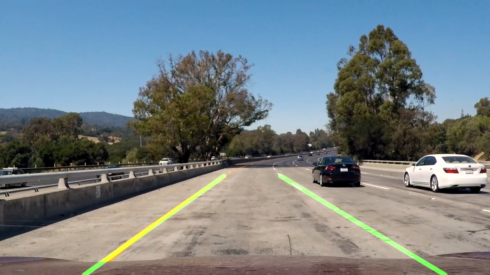
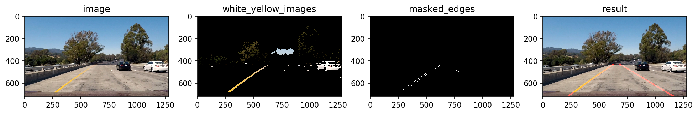

# **Finding Lane Lines on the Road** 

---

**Finding Lane Lines on the Road**

The goals / steps of this project are the following:
* Make a pipeline that finds lane lines on the road
* Reflect on my work in a written report





---

## Reflection

## 1. My pipeline and how I modified the draw_lines() function.

### Pipeline Flow

My pipeline consisted of 9 steps:
 1) Color Selection
 2) Convert images to grayscale
 3) Apply Gaussian blur to gray images
 4) Canny Edge Detection
 5) Create masked edges using trapezoid-shaped region-of-interest
 6) Hough Transform Line Detection
 7) Converting Hough transformed lines into straight lines
 8) Smoothing the result with a moving average filter
 9) Plotting the lines on top of the image

In order to draw a single line on the left and right lanes, I modified the draw_lines() function by ...

Here's a pipeline flow outline: 




### Averaging and Extrapolating Lines

When we try to detect a lane line, there will be multiple lines detected for a lane line, that's why we should come up with an averaged line for that.
In addition, we should extrapolate the line to cover full lane line length, since some lane lines are only partially recognized.
We will need two lane lines: left and right. The left lane should have a positive slope, and the right lane should have a negative slope.
See:
```
lane_lines()
```
Therefore, we'll need to collect positive slope lines and negative slope lines separately and take averages.
See:
```
average_slope()
```

## 2. Potential shortcomings with my current pipeline


 - One potential shortcoming would be my current pipeline can only detects straight lane lines.

 - Another shortcoming could be it won't work for steep (up or down) roads because the region of interest mask is assumed from the center of the image.


## 3. Possible improvements to my pipeline

 - We'll need to use perspective transformation and also poly fitting lane lines rather than fitting to straight lines.

 - For steep roads, we first need to detect the horizontal line (between the sky and the earth) so that we can tell up to where the lines should extend.
